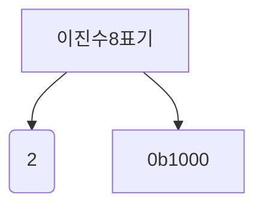
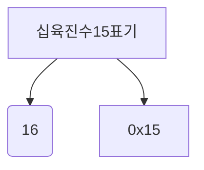

## 02-1, 0과 1로 <ins>숫자</ins>를 표현하는 방법

결국 컴퓨터가 이해하는 정보는 0과 1로 이루어진 정보밖에 이해하지 못한다.
컴퓨터는 0과 1 을 전기적 신호로 바꾸거나 전기적 신호를 0과 1로 바꾼다.

하지만 우리가 작성한 문자나, 숫자는 0과 1을 표현해야한다!

A -> (어떠한 과정을 거치면?) -> 0101010 ..

### 정보단위

비트(bit) : 0과 1을 나타내는 가장 작은 단위

하나의 비트는 0, 1 : 1가지 = 2^1
두개의 비트는 00, 01, 10, 11 : 4가지 = 2^2
새게의 비트는 000, 001, 010, 011, 100, 110, 101, 111 : 8가지 = 2^3

비트 n 개수로 나타낼 수 있는(표현할 수 있는 숫자 경우의 수) :  2^n 가지

우리가 매일 사용하는 프로그램 역시 수많은 비트로 이루어져 있음. 다만 293219031 개수의 비트가 저장되어있어 라고 표현하지 않고
비트 모다 더 큰 단위를 사용한다.

=> 바이트(byte), 킬로바이트(kb), 메가바이트(mb), 기가바이트(gb), 테라바이트(tb)

|             |                   |
|:-----------:|:-----------------:|
| 1바이트(1byte) |     8비트(8bit)     |
| 1킬로바이트(1kb) | 1000바이트(1000byte) |
| 1메가바이트(1mb) | 1000킬로바이트(1000kb) |
| 1기가바이트(1gb) | 1000메가바이트(1000mb) |
| 1테라바이트(1tb) | 1000기가바이트(1000gb) |

참고) 이전단위를 1024로 묶은 단위는 따로 존재한다!
- Kib, Mib, Gib

워드(word) : cpu 가 한번에 처리할 수 있는 정보의 크기 단위 
* ex) CPU 가 한번에 32까지 처리가능 -> 1워드 = 32bit
* 하프워드(half word) : 워드의 절반 크기
* 풀워드(full word) : 워드 크기
* 더블 워드(double word) : 워드의 두배 크기

### 이진법

0과 1만으로 숫자를 표현하는 방법 중 하나.
수가 표현하는 숫자를 0과 1의 조합으로 만들기 위해 이진법을 사용한다.

이진수 표기법


### 이진수 음수표편

2의 보수법
* 어떤 수를 그 보다 큰 2^n 에서 뺀 값
* 0과 1로 <ins>음수</ins>를 표현하는 방법 중 하나

11(2) 보다 큰 2^n = 100(2)

100(2) - 11(2) = 01(2)

11(2) 를 음수로 표현한 값 01(2)
쉽게하는 방법?
=> 모든 0과 1을 뒤집고 거기에 1을 더 한값

당연히 2의 보수법을 이용해서 음수를 표현한 값에 다시 2의 보수법을 적용하면 원래의 값이 나온다.


❓질문  

-1011(2) 를 표현하기 위한 음수로서의 0101(2) 과 십진수 5를 표현하기 위한 양수로서의 0101(2) 은 똑같이 생겼는 데 이진수만 보고 어떻게 음수인지 양수인지 구분하나?

✅답  
컴퓨터 내부에서 어떤 수를 다룰 때는 이 수가 양수인지 음수인지를 구분하기 위해 <ins>플래그(flag)</ins> 를 사용한다. 


### 십육진법

이진법은 0과 1만으로 모든 숫자를 표현하기 때문에 숫자의 길이가 길어진다.
32라는 숫자만 보더라도 32의 이진수는 100000(2) 이며, 6자리이다.

십육진법 : 수가 15를 넘어가는 시점에 자리올림을 하는 숫자표현방법


|  진수  |                  값                  |
|:----:|:-----------------------------------:|
| 십진수  | 1 2 3 4 5 6 7 8 9 10 11 12 13 14 15 |
| 십육진수 |   0 1 2 3 4 5 6 7 8 9 A B C D E F   |


십육진법 표기법


다른 진법도 많은 데 왜 16진법을 사용할까? -> 2진수와 16진수같의 변환이 쉽다!

### 십육진법 -> 이진수로 바꾸기
가령 1A2B(16) 이라고 하는 16진수 값이 있다고 가정한다.
16진수 값에서 하나의 값은 4개의 비트로 표현된다 (16 = 2^4 = 비트 4개)

(추가로 A ~ F 가 10 ~ 15 까지 나타낸다는 것만 외우자, 당연히 1 ~ 15 까지의 십진수를 2진수로 표현하는 것은 자유자재로 할 수 있어야함, 16진수를 10진수로 바로 바꾸는 건 어렵다. 끊어서 생각하자)


따라서 각 자리수를 2진수로 바꿔보면 아래와 같다.

1 = 0001(2)  
A = 1010(2)  
2 = 0010(2)  
B = 1011(2)  

이제 합치기만 하면된다.
1A2B(16) = 0001101000101011(2)

### 이진수 -> 십육진수로 바꾸기
D5(16)

1. 한자리씩 끊는다.(한자리 = 16진수이기 때문에 4비트 차지)
2. 각 자리수를 머리속으로 10진법 생각 후 바로 2진수로 변환
3. 각 자리수마다 구한 2진수를 이어붙히면 끝

D = 13 = 1101 ( 이것도 생각할 때 8 + 4 + 1 이렇게 하면 편하다 )  
5 = 5 = 0101

=> D5(16) = 11010101(2)

## 02-2, 0 과 1로 <ins>문자</ins>를 표현하는 방법
### 문자집합과 인코딩

* **문자집합(character set)** : 컴퓨터가 이해할 수 있는 문자의 모음
* **인코딩(encoding)** : en + coding
  * 말 그대로 en(~하게하다) + code(코드) : 코드화 하는 과정
  * 문자를 0과 1로 이루어진 문자코드로 변환하는 과정
* **디코딩(decoding)** : de + coding
  * 코드를 해석하는 과정
  * 0과 1로 표현된 <ins>문자코드</ins>를 우리가 이해할 수 있는 <ins>문자로 변환하는 과정</ins>

### 아스키코드
* 초창기 문자 집합 중 하나
* 알파벳, 아라비아 숫자, 일부 특수 문자 및 제어문자.
  * 7 비트로 하나의 문자표현 8비트중 1비트는 오류 검출을 위해 사용되는 패리티 비트(parity bit)
  * 따라서 2^7 개의 문자 표현이 가능하다!

BUT! 간단한 인코딩의 경우 아스키코드를 이용해서 가능하지만 한글을 포함한 다른 언어 문자, 다양한 특수문자 표현 불가능
물론 extended ASCII(8비트) 가 나왔지만 여전히 부족하다.

### ECU-KR

각 나라별 인코딩 방식 도입, 한글을 위한 인코딩 필요
* 한글의 특징? 
  * 알파벳을 이어쓰면 단어가 되는 영어와 달리 초성, 중성, 종성의 조합으로 이루어진 한글
  * 완성형 인코딩 방식과 조합형 인코딩 방식 존재

완성형 인코딩 방식 : 초성, 중성, 종성의 조합으로 이루어진 완성된 하나의 글자에 고유한 코드를 부여하는 인코딩 방식
'가'는 1, '나'는 2 이런 식으로

조합현 인코딩 방식 : 초성을 위한 비트열, 종성을 위한 비트열, 종성을 위한 비트열을 할당하여 조합하는 인코딩 방식


ECU-KR 은 KS X 1001, KS X 1003 이라는 문자 집합을 기반으로 만들어진 완성형 인코딩 방식을 채택하고 있음.
한글 단어에 2바이트 크기의 코드를 부여함.

'강' 이라고 하는 단어는 2바이트 즉, 16비트로 표현 가능하다.(16비트 -> 16진수로 표현하면 4자리수로 표현가능)

'가' 의 경우 b0a1 로 <ins>인코딩</ins> 됨.

2350 여개의 한글단어만 표현할 수 있음. 따라서 문자집합에 정의되지 않은 '뷁', '뷇' 같은 글자는 ECU-KR 로 표현할 수 없음
'뷁' 같은 글자는 웹사이트에서 한글이 깨지는 문제 발생

따라서 마이크로소프트에서 ECU-KR 의 확장 버전인 CP949 가 나왔지만, 이것 또한 부족했다.


### 유니코드와 UTF-8

각 나라마다 인코딩을 만드는 것도 복잠. 매번 다른 표준!
이에 따라 등장한 것이 바로 **유니코드(unicode)**

유니코드 : 여러 나라의 문자를 광범위하게 표현할 수 있는 통일된 문자 집합.

```text
1. 유니코드는 인코딩 방식을 뜻하는 것이 아니다! 유니코드는 문자집합

2. 유니코드 글자 앞에 U+ 는 16진수로 유니코드를 표현할 때 사용하는 표기임 
```

ECU-KR 은 글자에 부여된 값을 그대로 인코딩 값으로 삼은반면
유니코드의 경우 부여된 값 자체를 인코딩 값으로 감지 않고 이 값을 다양한 방법으로 인코딩 함.
대표적인 인코딩 방식이 UTF-8, UTF-16, UTF-32 등이 있다. 
즉, `유니코드 문자에 부여된 값을 인코딩 하는 방식을 뜻함`


UTF-8 의 경우 유니코드 문자에 부여된 값의 범위에 따라 1바이트에서 4바이트까지의 인코딩 결과를 만들어낸다.
즉, 어떤 인코딩 방식을 쓰느냐에 따라 실제 인코딩 결과값은 다를 수 있다.

<details>
<summary>🤔[문제] 친구 컴퓨터에서 깨지지 않고 잘 보였던 문서가 내 컴퓨터에는 글자가 깨져서 보인다!! 어떤 것을 추측해볼 수 있을까 ??</summary>
</details>
<details>
<summary>🧩[정답 보기]</summary>
1. 혹시 인코딩이 호환되지 않는 가?  
2. 문자집합에 속하지 않는 문자를 사용하고 있나? - ECU-KR  
</details>
