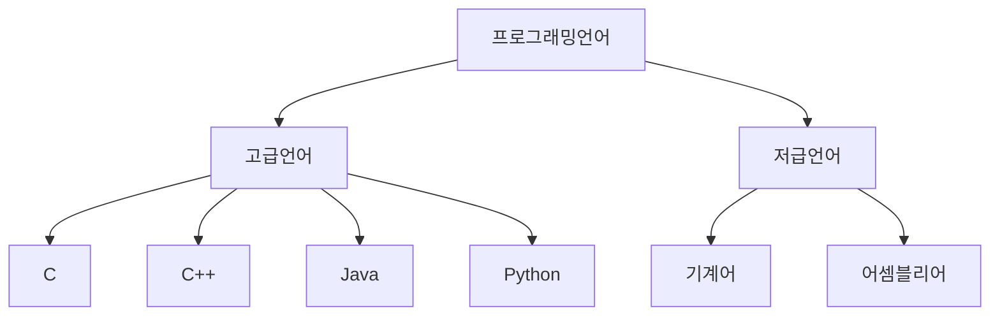
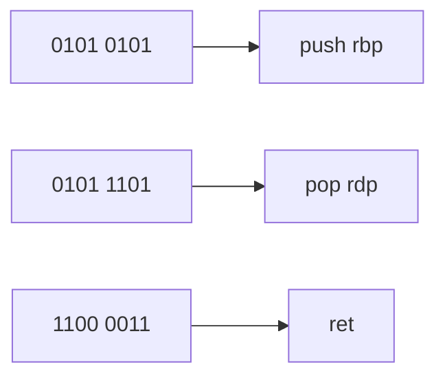
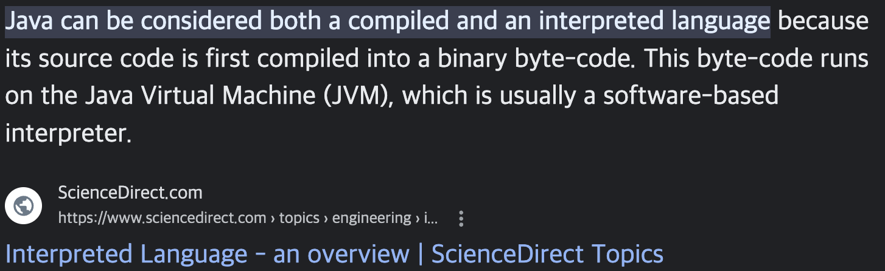

## 03-1 소스 코드와 명령어

다시 정리하자.
컴퓨터는 명령어를 처리하는 기계이다.

우리가 쓰는 문자나 숫자는 모두 컴퓨터가 처리할 수 있는 0 과 1의 숫자로 바뀌어 해석된다.
그렇다면 우리가 작성하는 코드는 어떻게 해석되는 걸까?
당연히 이 또한 0과 1의 기계어로 바뀌어야 한다.

결국 모든 소스코드는 컴퓨터 내부에서 명령어로 변환된다.

### 고급언어와 저급언어

고급언어 : 사람이 이해하고 작성하기 쉽게 만들어진 언어  
저급언어 : 컴퓨터가 직접 이해하고 실행할 수 잇는 언어

우리가 작성하는 대부분의 프로그래밍 언어는 고급언어에 속한다. C, C++, Java, Python 등등

기계어는 0과 1의 명령어 비트로 이루어진 언어이다.
하지만 기계어의 경우 0과 1로만 이루러져있기 때문에 사람이 이해하기가 쉽지않다.
그렇다고 16진수로 줄인다고 한들 여전히 이해하기가 쉽지않다. 

그래서 등장한 저급언어가 어셈블리어 이다.
어셈블리어는 0과 1의 명령어로 이루어진 기계어를 읽기 편한 형태로 번역한 언어이다.

하지만 어셈블리어로 코드를 작성하는 것은 쉽지않다. 그렇기 때문에 조금 더 사람이 이해하고 작성하기 편한 고급언어로 코드를 작성하게 된다.
(물론, 임베디드 개발자나 혹은 하드웨어와 밀접하게 연관되어 있는 개발자는 어셈블리어를 다루기도 한다.)
실제 코드에서 어셈블리어를 직접 작성 할수 도 있다

### 컴파일언어와 인터프리터 언어

C, C++, Java 와 같은 고급언어로 작성된 코드들은 결국 저급언어로 변환하는 과정이 필요하다.
이때 어떻게 변환되는 지에 따라 크게 두 가지로 나뉠 수 있다.

1. 컴파일방식
2. 인터프리터방식

이때 컴파일 방식으로 작동하는 언어를 **컴파일 언어**, 인터프리터 방식으로 작동하는 프로그래밍 언어를 고급언어로 작성된 코드들 **인터프리터 언어** 라고 한다.

참고로 특정 언어가 무조건 컴파일언어 아니면 인터프리터언어 라고 구분할 수 없다. 가령 Java 의 경우 컴파일과 인터프리터 방식을 모두 사용하기 때문에 딱 잘라서 이야기 할 수는 없다.
물론 C, C++ 과 같이 명확히 컴파일언어라고 지칭할 수 있는 언어도 존재함.

컴파일 하면 인터프리터는 못하고 반대고 인터프리터를 하면 컴파일은 못한다의 개념은 아니다.

### 컴파일 언어

* 컴파일러에 의해 소스코드 전체가 저급언어로 변환되어 실행되는 고급언어
* 따라서 소스코드내에 오류가 하나라도 있으면 컴파일이 불가능
* 컴파일러에 의해 컴파일이 성공적으로 수행하여 변환된 저급언어, 코드를 목적코드(object code) 라고 부른다. 

### 인터프리터 언어
* 인터프리터에 의해 소스코드가 한 줄씩 실행되는 고급언어(대표적으로 Python)
* 그래서 N 번째 줄에 오류가 있더라도 그 전줄 까지는 올바르게 수행됨
* 그렇기 때문에 일반적으로 모든 소스코드를 한번에 컴파일하여 컴퓨터가 이해할 수 있는 저급언어로 변환할 수 있는 컴파일 언어보다 느리다. 

### 목적파일 vs 실행파일

* 목적파일이란, 목적코드로 이루어진 파일을 뜻함.
* 실행파일이란, 실행코드로 이루어진 파일을 뜻함.
* 컴파일을 통해서 목적코드로 만들어진 목적파일은 실행할 수 있는 형태가 아님
* 목적코드가 실행파일이 되기 위해서는 링킹(linking) 이라는 작업을 거쳐야함.
* 외부 기능을 동작하기 위한 코드를 포함시켜야하는 데 이것을 링킹이라고 함.

