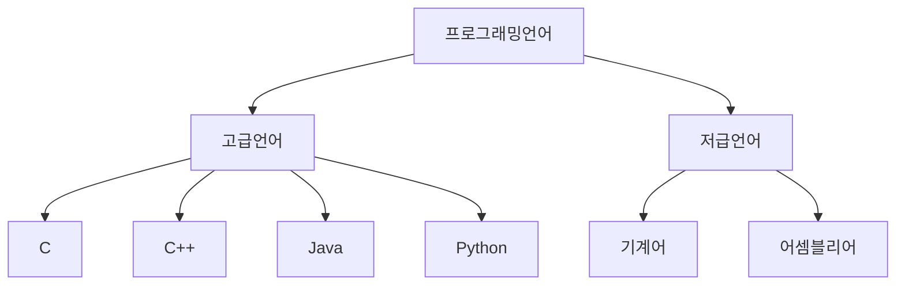
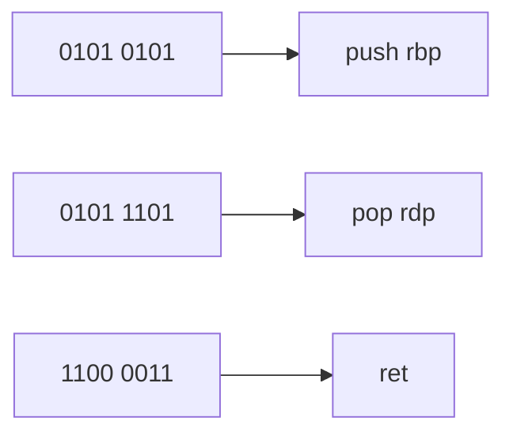

## 03-1 소스 코드와 명령어

다시 정리하자.
컴퓨터는 명령어를 처리하는 기계이다.

우리가 쓰는 문자나 숫자는 모두 컴퓨터가 처리할 수 있는 0 과 1의 숫자로 바뀌어 해석된다.
그렇다면 우리가 작성하는 코드는 어떻게 해석되는 걸까?
당연히 이 또한 0과 1의 기계어로 바뀌어야 한다.

결국 모든 소스코드는 컴퓨터 내부에서 명령어로 변환된다.

### 고급언어와 저급언어

고급언어 : 사람이 이해하고 작성하기 쉽게 만들어진 언어  
저급언어 : 컴퓨터가 직접 이해하고 실행할 수 잇는 언어



우리가 작성하는 대부분의 프로그래밍 언어는 고급언어에 속한다. C, C++, Java, Python 등등

기계어는 0과 1의 명령어 비트로 이루어진 언어이다.
하지만 기계어의 경우 0과 1로만 이루러져있기 때문에 사람이 이해하기가 쉽지않다.
그렇다고 16진수로 줄인다고 한들 여전히 이해하기가 쉽지않다.

그래서 등장한 저급언어가 어셈블리어 이다.
어셈블리어는 0과 1의 명령어로 이루어진 기계어를 읽기 편한 형태로 번역한 언어이다.



하지만 어셈블리어로 코드를 작성하는 것은 쉽지않다. 그렇기 때문에 조금 더 사람이 이해하고 작성하기 편한 고급언어로 코드를 작성하게 된다.
(물론, 임베디드 개발자나 혹은 하드웨어와 밀접하게 연관되어 있는 개발자는 어셈블리어를 다루기도 한다.)
실제 코드에서 어셈블리어를 직접 작성 할수 도 있다

### 컴파일언어와 인터프리터 언어

C, C++, Java 와 같은 고급언어로 작성된 코드들은 결국 저급언어로 변환하는 과정이 필요하다.
이때 어떻게 변환되는 지에 따라 크게 두 가지로 나뉠 수 있다.

1. 컴파일방식
2. 인터프리터방식

이때 컴파일 방식으로 작동하는 언어를 **컴파일 언어**, 인터프리터 방식으로 작동하는 프로그래밍 언어를 고급언어로 작성된 코드들 **인터프리터 언어** 라고 한다.

참고로 특정 언어가 무조건 컴파일언어 아니면 인터프리터언어 라고 구분할 수 없다. 가령 Java 의 경우 컴파일과 인터프리터 방식을 모두 사용하기 때문에 딱 잘라서 이야기 할 수는
없다.
물론 C, C++ 과 같이 명확히 컴파일언어라고 지칭할 수 있는 언어도 존재함.

컴파일 하면 인터프리터는 못하고 반대고 인터프리터를 하면 컴파일은 못한다의 개념은 아니다.


### 컴파일 언어

* 컴파일러에 의해 소스코드 전체가 저급언어로 변환되어 실행되는 고급언어
* 따라서 소스코드내에 오류가 하나라도 있으면 컴파일이 불가능
* 컴파일러에 의해 컴파일이 성공적으로 수행하여 변환된 저급언어, 코드를 목적코드(object code) 라고 부른다.

### 인터프리터 언어

* 인터프리터에 의해 소스코드가 한 줄씩 실행되는 고급언어(대표적으로 Python)
* 그래서 N 번째 줄에 오류가 있더라도 그 전줄 까지는 올바르게 수행됨
* 그렇기 때문에 일반적으로 모든 소스코드를 한번에 컴파일하여 컴퓨터가 이해할 수 있는 저급언어로 변환할 수 있는 컴파일 언어보다 느리다.

### 목적파일 vs 실행파일

* 목적파일이란, 목적코드로 이루어진 파일을 뜻함.
* 실행파일이란, 실행코드로 이루어진 파일을 뜻함.
* 컴파일을 통해서 목적코드로 만들어진 목적파일은 실행할 수 있는 형태가 아님
* 목적코드가 실행파일이 되기 위해서는 링킹(linking) 이라는 작업을 거쳐야함.
* 외부 기능을 동작하기 위한 코드를 포함시켜야하는 데 이것을 링킹이라고 함.

## 03-2 명령어의 구조

명령어의 구조는 어떠할까?
우리가 누군가에게 명령하는 것과 크게 다르지 않다.

"OO야 방좀 치워라!"
"민식아 CS 공부해라!"

결국 형태는 무엇을 '대상' 으로 무엇을 '수행'하라 형식이다.

실제 명령어도 이와 비슷하게 구성되어 있다.

### 연산코드와 오퍼랜드


| 연산코드 |     오퍼랜드     |     오퍼랜드      |
|:----:|:------------:|:-------------:|
| 더해라  |     100과     |     120을      |
|  빼라  | 32번지에 저장된 값과 | 메모리 32번지 안의 값 |
| 저장해라 |     10을      |  메모리 128번지에   |

명령어 : 연산코드 + 오퍼랜드
* 연산코드(연산자) : '명령어 가 수행할 연산'
* 오펴랜드(피연산자) : '연산에 사용할 데이터' 혹은 '연산에 사용할 데이터가 저장된 위치'
* 연산 코드 필드 : 연산 코드가 담기는 영역
* 오퍼랜드필드 : 오퍼랜드가 담기는 영역

### 오퍼랜드
* 오퍼랜드에는 '연산에 사용될 데이터' 또는 '연산에 사용할 데이터가 저장된 위치'를 의미함.
* 숫자나 문자를 나타내는 데이터 이외에도 메모리나 레지스터 주소가 올 수 있음.
* 다만, 오퍼랜드 필드에는 숫자나 문자와 같이 연산에 사용할 데이터를 직접 명시하기 보다는 많은 경우, 사용할 데이터가 저장된 위치, 즉 메모리 주소나 레지스터 이름이 담김
* 그래서 오퍼랜드 필드를 **주소 필드** 라고 부르기도 함.

오퍼랜드는 명령어 안에 하나도 없을 수도 있고, 1개, 2개, 3개 등 여러개가 있ㅇ르 수 있다.

0-주소명령어 : 오퍼랜드가 하나도 없는 명령어
1-주소명령어 : 오퍼랜드가 하나 있는 명령어
2-주소명령어 : 오퍼랜드가 두개 있는 명령어
3-주소명령어 : 오퍼랜드가 세게 있는 명령어

### 연산코드

기본적인 연산 코드 유형 4가지
1. 데이터 전송 
2. 산술/논리 연산 
3. 제어 흐름 변경 
4. 입출력 제어

#### 1. 데이터 전송
* MOVE : 데이터를 옳겨라
* STORE : 메모리에 저장하라
* LOAD(FETCH) : 메모리에서 CPU로 데이터를 가져와라
* PUSH : 스택에 데이터를 저장하라
* POP : 스택의 최상단 데이터를 가져와라

#### 2. 산술/논리 연산
* ADD / SUBTRACT / MULTIPLY / DIVIDE : 덧셈, 뺄셈, 곱셈, 나눗셈을 수행하라
* INCREMENT / DECREMENT : 오퍼랜드에 1을 더하라 / 오퍼랜드에 1을 빼라
* AND / OR / NOT : AND / OR / NOT 연산을 수행하라
* COMPARE : 두개의 숫자 또는 TRUE / FALSE 값을 비교하라

#### 3. 제어 흐름 변경
* JUMP : 특정 주소로 실행 순서를 옮겨라
* CONDITIONAL : 조건에 부합할 때 특정 주소로 실행 순서를 옮겨라.
* HALT : 프로그램 실행을 멈춰라
* CALL : 되돌아올 주소를 저장한 채 특정 주소로 실행 순서를 옮겨라
* RETURN : CALL 을 호출할 때 저장했던 주소로 돌아가라

#### 4. 입출력제어
* READ(INPUT) : 특정 입출력 장치로부터 데이터를 읽어라
* WRITE(OUTPUT) : 특정 입출력 장치로 데이터를 써라
* START IO : 입출력 장치를 시작하라
* TEST IO : 입출력 장치의 상태를 확인하라

### 주소지정방식

오퍼랜드에는 연산에사용할 데이터를 저장하기도 하지만, 대부분 연산에 사용할 데이터가 저장된 위치를 저장하기도 한다.

🤔 직접 데이터를 저장하면 더 좋을 텐데 왜 저장된 위치를 저장해서 번거롭게 또 찾아가도록 할까

❗️결론부터 말하면 제한된 명령어의 길이 때문이다.
하나의 명령어가 n 비트로 구성되어 있고, 연산코드 필드가 m 비트라고 하면 오퍼랜드가 사용할 수 있는 비트 수는 n-m 비트이다.
만약 16비트의 명령어가 있다고 가정했을 때 연산코드가 4비트만 차지한다고 해도 0-주소명령어에서는 12비트 정도 밖에 남지 않는다.
만약 2-주소 명령어 라면 오퍼랜드 필드는 더욱 더 작아지게 될것이다.

16비트 명령어에 연산코드 필드가 4비트인 2-주소 명령어인 경우에는 오퍼랜드 필드당 6비트 기껏해봐야 2^6 = 64 까지의 숫자 밖에 표현할 수 없다.
16비트 명령에 연산코드 필드가 4비트인 3-주소 명령인 경우에는 오퍼랜드 필드당 4비트(2^4) 16 까지 숫자 밖에 표현할 수 없게 된다.

즉 더 큰 숫자를 표현할 수 없기 때문에 실제 값이 저장된, 연산에 사용될 데이터가 저장된 위치를 담는 다.


### 명령어 주소 지정 방식

* 유효 주소 : 연산에 사용될 데이터가 저장된 위치
* 명령어 주고 지정 방식
  * 연산에 사용될 데이터가 저장된 위치를 찾는 방법
  * **유효 주소** 를 찾는 방법(A -> B -> C -> Data(유효주소))
  * 다양한 명령어 주소 지정 방식들이 있다

명령어를 보고 이 명령어에 사용될 데이터가 어디에 저장되어 있구나! 라고 판단하는 방법(CPU 마다 차이는 존재)

1. 즉시 주소 지정 방식(immediate addressing mode)
2. 직접 주소 지정방식
3. 간접 주소 지정방식
4. 레지스터 주소 지정방식
5. 레지스터 간접 주소 지정방식

#### 1. 즉시 주소 지정 방식

* 연산에 사용할 데이터를 오퍼랜드 필드에 직접 명시
* 가장 간단한 형태의 주소 지정 방식
* 연산에 사용할 데이터의 크기가 작아질 수 있지만 빠르다!
  * 왜? 당연히 추가적으로 메모리에 더 찾아보지않으니까


#### 2. 직접 주소 지정 방식(direct addressing mode)
* 오퍼랜드 필드에 유효주소 직접적으로 명시
* 유효 주소를 표현할 수 있는 크기가 연산 코드만큼 줄어듦

#### 3. 간접 주소 지정 방식(indirect addressing mode)
* 오퍼랜드 필드에 유효주소의 주소를 명시
* 앞선 주소 지정 방식들에 비해 속도가 느림

CPU 가 메모리에 접근을 많이 하면 할 수록 속도가 느려진다.
즉, 메모리 접근 최소화 하는 것이 속도 빠르다.

#### 4. 레지스터 주소 지정방식(register addressing mode)
* 연산에 사용될 데이터가 저장된 레지스터 주소를 명시
* 메모리에 접근하는 속도보다 레지스터에 접근하는 것이 빠르다.(레지스터는 CPU 에 있는 작은 임시 저장 공간, 비싸고 물리적으로도 메모리보다 가깝게 위치함)


#### 5. 레지스터 간접 주소 지정 방식(register indirect addressing mode)
* 연산에 사용할 데이터를 메모리에 저장
* 그 주소를 저장한 레지스터를 오퍼랜드 필드에 명시


### 정리퀴즈
<details>
<summary>명령어는 무엇으로 구성 되어있나요?</summary>

```text
명령어는 연산코드와 오퍼랜드로 구성되어 있습니다.
연산코드는 말 그대로 명령어가 수행할 연산(더해라, 가져와라, 멈춰라 등등) 을 뜻하고 
오퍼랜드는 '연산에 사용 될 데이터' 또는 '연산에 사용 될 데이터가 저장된 위치' 를 뜻합니다.
```
</details>

<details>
<summary> 연산코드에는 어떤 것들이 있나요? </summary>
</details>

<details>
<summary> 오퍼랜드 필드에 왜 굳이 데이터를 바로 저장하지 않고 연산에 사용될 데이터의 주소를 저장하도록 했나요? </summary>
</details>

<details>
<summary> 주소 지정 방식이 뭔가요? 어떤 것들이 있나요? </summary>
</details>


