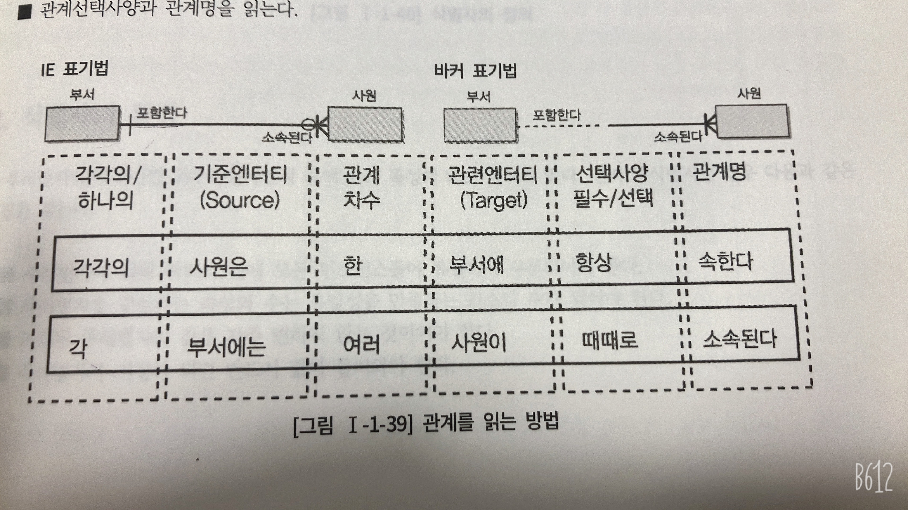

데이터 모델을 읽을 때 특히 관계가 정의된 부분을 읽는 부분이 어려워서 정리해보았다.

> 관계명(Membership) : 관계이 이름  
> 관계차수(Cardinality) : 1:1, 1:M, M:N  
> 관계선택사양 : 필수관계, 선택관계

데이터 모델을 읽는 방법은 먼저 관계에 참여하는 기준 엔티티를 하나 또는 각(Each)으로 읽고, 대상 엔티티의 개수(하나, 하나 이상)를 일고 관계 선택 사양과 관계명을 읽도록 한다.
* 기준(Source) 엔티티를 한개(One) 또는 각(Each) 으로 읽는다.
* 대상(Target) 엔티티의 관계참여도, 즉 개수(하나, 하나 이상)를 읽는다.
* 관계선택사양과 관계명을 읽는다.

