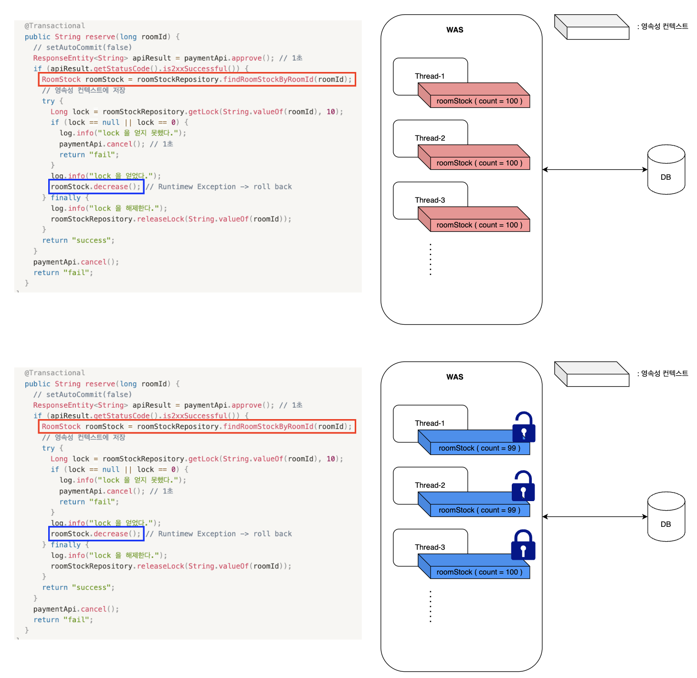
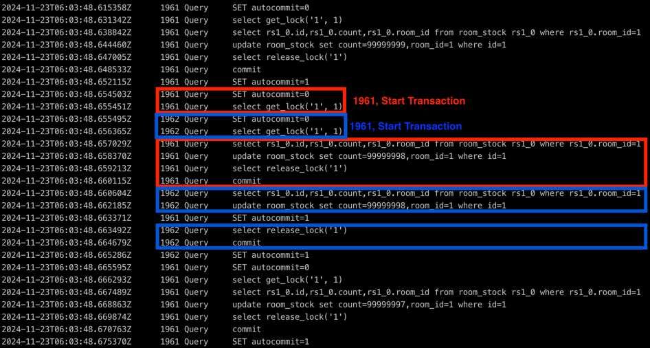

# 2024.11.10 - 다시금 깨닫는 영속성 컨텍스트와 DB 격리 레벨 중요성

> Lock 과 관련한 간단한 코드를 작성하고 테스트를 실했을 때 원치않은 결과가 계속 나오는 것을 보고
도대체 잘못된 결과가 나온 것일까? 결론부터 말하자면 
> 1. __영속성  컨텍스트를 생각하지 않았던 것__
> 2. __Lock 의 범위 설정을 잘하지 못한 것__
> 3. __(사실 가장 중요하다) MySQL 의 InnoDB 엔진 기본 Isolation Level 을 고려하지 않을 것__





https://www.baeldung.com/jpa-hibernate-persistence-context

### 원인 분석 과 해결 과정
만약 Lock 을 10초 동안 기다려서 획득했을 때의 roomStock 은 새롭게 BD 에서 값이 갱신된 roomStock 정보가 아닌 앞에서 조회했던 객체 즉, 영속성 컨텍스트에 있던 객체이다.
따라서 최악의 경우에는 아래와 같이 동작한다.

즉, Lock 을 흭득하는 것은 좋았으나, 문제는 JPA 의 업데이트 하려고 하는 roomStock 데이터는 영속성 컨텍스트에서 조회하기 때문에 
다른 스레드가 roomStock 의 count 를 업데이트 해서 값이 변경 되었지만, 영속성 컨텍스트에서 데이터를 가져와서 갱신하기 때문에 데이터 불일치가 발생한다.

#### 수정된 코드
여전히 문제가 많습니다..
```java

@Transactional
  public String reserve(long roomId) {
    try {
      Long lock = roomStockRepository.getLock(String.valueOf(roomId), 1);
      if (lock == null || lock == 0) {
        log.info("lock 획득 실패");
        return "fail";
      }
      log.info("acquire Lock !");
      RoomStock roomStock = roomStockRepository.findRoomStockByRoomId(roomId).orElseThrow();
      roomStock.decrease();
    } catch (RuntimeException e) {
      log.warn(e.getMessage());
    } finally {
      roomStockRepository.releaseLock(String.valueOf(roomId));
      log.info("release Lock !");
    }
      return "success";
  }

```
위의 코드는 실행이 잘 될까? 결론부터 말하자면 이 역시 제대로 동작하지 않는다.

동작하지 않은 이유 추측 1 : lock 을 해제 한 후 commit 하기 전(즉, flush 가 일어나서 실제로 db에 반영되기 전)에 다른 thread 가 lock 을 획득하는 경우 
commit 이전에 다른 스레드가 lock 을 획득하고 findRoomStockByRoomId 을 통해 RoomStock 을 가져온다면 이론상 가능하다.
하지만 테스트한 환경에서는 그러한 상황이 연출되지 않았다.

MySQL general_log 를 활성한 후, tx 별 로그를 살펴봐도 위와 같은 상황은 연출되지 않았음에도 불구하고 원하는 결과가 나오지 않았다.
박스로 표시된 부분이 문제가 되는 부분이다.


MySQL 의 InnoDB 스토리지 엔진에서 기본으로 사용되는 격리수준은 REPEATABLE READ 이다.
1961 tx 가 먼저 commit 을 한 이후 1962 tx 가 조회하고 update 했을 때 바로 commit 이후에 변경된 값이 아닌 저장된 스냅샷으로 부터 데이터를 조회하게 된다.

### 해결

1. 이를 해결하기 위해 Lock 획득을 먼저 한 후 RoomStock 을 조회를 할 수 있도록 코드를 변경해야한다.(사실 애초에 이렇게 작성했다면 문제가 없었을 까?.)
2. MySQL 엔진을 InnoDB 로 사용하는 경우 기본 래벨은 REPEATABLE READ 이다. 이 격리 수준에서는 트랜잭션 시작 시점에 생성된 스냅샷을 기준으로 데이터를 읽기 때문에 실제 제고를 SELECT 하고 감소할 때는 @Transactional(propagation = Propagation.REQUIRES_NEW) 이용하여 새로운 트랜잭션을 시작, 스냅샷으로 부터 데이터를 조회하지 않도록 하는 방법을 사용할 수 있다.
```java

@Service
@Slf4j
public class ReservationService {

  private final RoomStockRepository roomStockRepository;
  private final RoomStockService roomStockService;

  public ReservationService(RoomStockRepository roomStockRepository, RoomStockService roomStockService) {
    this.paymentApi = paymentApi;
    this.roomStockRepository = roomStockRepository;
    this.roomStockService = roomStockService;
  }

  // 증명하고자 하는 것
  // => thread x 가 release 하고 나서 flush 하기 전에 thread y 가 lock 획득하고 room_stock 을 조회해서 잘못된 데이터를 가져오지 않았을 까?
  @Transactional
  public String reserve(long roomId) {
    try {
      Long lock = roomStockRepository.getLock(String.valueOf(roomId), 1);
      if (lock == null || lock == 0) {
        log.info("lock 획득 실패");
        return "fail";
      }
      log.info("acquire Lock !");
      roomStockService.decrease(roomId);
    } catch (RuntimeException e) {
      log.warn(e.getMessage());
    } finally {
      Long aLong = roomStockRepository.releaseLock(String.valueOf(roomId));
      log.info("release Lock ! : {}", aLong == 1);
    }
    return "success";
  }
}


@Slf4j
@Service
public class RoomStockService {

  private final RoomStockRepository roomStockRepository;

  public RoomStockService(RoomStockRepository roomStockRepository) {
    this.roomStockRepository = roomStockRepository;
  }


  @Transactional(propagation = Propagation.REQUIRES_NEW)
  public void decrease(long roomId) {
    try {
      RoomStock roomStock = roomStockRepository.findRoomStockByRoomId(roomId).orElseThrow();
      roomStock.decrease();
      roomStockRepository.saveAndFlush(roomStock);
    } catch (RuntimeException e) {
      log.warn(e.getMessage());
    }
  }
}

```

참고로, Transaction 을 길게 잡는 다면 그 만큼 스레드 당 DB 커넥션 을 점유하는 시간이 늘어날 수 밖에 없다. 이는 커넥션 풀을 더 빨리 마르게 하는 요인이 될 수 있다. 즉, 빨리 커넥션 을 사용하고 DBCP 에 반납해줘야 하는 데 불필요하게 오래 잡고 있다보니 뒤이어 오는 요청 슬레드 들은 커넥션 을 얻을 때 까지 기다릴 수 밖에 없다. 따라서 응답시간은 길어지게 된다.

> 참고로 영속성 컨텍스트는 두 가지 스코프 타입이 존재하는 데
> 1. Transaction-Scoped : 말 그대로, 영속성 컨텍스트가 존재하는 범위가 Transaction 까지 이다. 따라서 트랜잭션이 끝나면 해당 영속성 컨텍스트를 flush 하게 됩니다.
> 2. Extended-Scoped : 여러 트랜잭션에 걸쳐 있을 수 영속성 컨텍스트 로서. 트랜잭션 없이도 엔터티를 지속할 수 있지만 트랜잭션 없이는 flush 할 수 없습니다.
> 기본적으로 아무 설정을 하지 않는다면 Persistence-Context 의 기본 Scope 는 Transaction-Scoped 이다.
> ```java
> @Repeatable(PersistenceContexts.class)
> @Target({TYPE, METHOD, FIELD})
> @Retention(RUNTIME)
> public @interface PersistenceContext {
>
>    // ...
>
>    /**
>     * (Optional) Specifies whether a transaction-scoped persistence context 
>     * or an extended persistence context is to be used.
>     */
>    PersistenceContextType type() default PersistenceContextType.TRANSACTION;
>    
>    // ...
> }
> ```
