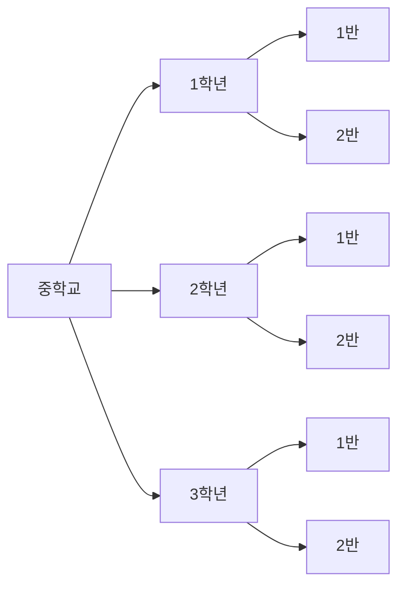

## 패키지(package) 와 사용이유
패키지(package) 의 사전적의미는 "상자, 포장뮬"이라는 의미이다.  
패키지는 클래스들을 구준 짓는 폴더와 비슷한 개념이다.


가령 중학교의 학급 현황을 학년별 그리고 학급별로 나누어 생각하는 것은 아주 지극히 자연스러운 일이다.
만약 "1반에 있어요"이라고만 말하기 보다는 "중학교 1학년 1반에 있어요" 라고 말하는 것이 현재의 상태를 체계별로 잘 설명하는 것이라고 생각할 수 있다.

마찬가지로 자바 애플리케이션을 개발할 때 클래스들을 분류하지 않으면 이름이 중복되거나, 어떤 클래스가 어떤 일을 하는 지 혼동되는 일이 발생한다.
그래서 존재하는 것이 "패키지" 이다.

패키지 별로 정리정돈이 잘 된 소스코드와 그렇지 못한 소스코드는 개발 생산성에도 영향을 준다.  
어떤 클래스가 어떤 역할을 하는 지 상관없이 하나의 폴더 안에 들어가 있다면? 매번 파일이름을 보면 서 클래스 파일을 찾아다니는 데 시간을 허비할 것이다.

```text
$pwd

code/godofjava/c/javapackage
```
```java
package c.javapackage;

public class Package {
  public static void main(String[] args) {
    System.out.println("Package class.");
  }
}
```

가장 첫줄에 "package.c.javapacakge" 라고 선언되어 있는 부분이 바로 패키지 선언문이다.
이떄 패키지를 작성할 떄 기본적으로 지켜야할 것들이 있다.
1. 소스의 가장 첫 줄에 있어야 한다.(package 선언 위에 주석이나 공백이 있어도 상관 없다. 단, 다른 자바 문장이 하나라도 있으면 컴파일이 제대로 되지 않는다.)
   * **Java 컴파일러는 소스 코드를 읽을 때, 해당 파일이 어떤 패키지에 속하는지를 알아야 한다**. 따라서 소스 코드의 맨 처음에 패키지 선언이 있어야 컴파일러가 올바른 패키지를 사용하여 클래스를 로드하고 관리할 수 있습니다. 만약 다른 자바 문장이 패키지 선언 전에 온다면, 컴파일러는 해당 파일이 어떤 패키지에 속하는지를 알 수 없어서 컴파일 오류가 발생할 수 있다.
2. 패키지 선언은 소스 하나에는 하나만 있어야 한다.
   * 한 소스 파일이 두개의 폴더에 한번에 존재할 수 없기 때문에 당연하다. 
3. 패키지 이름과 위치한 폴더 이름이 같아야만 한다. 
4. 패키지 이름을 정할 때는 java 로 시작해서는 안된다.
   * `Prohibited package name: java` 라는 에러가 난다. 우리는 java 를 만드는 사람이 아니기 때문에 패키지 이름을 java 로 시작해서는 안된다.
* 패키지 이름은 모두 소문자로 지정해야한다.(반드시는 아니지만 소문자를 사용하기로 약속되어 있다.)
* 자바의 예약어를 패키지 이름으로 사용해서는 안된다.

또한 자바는 해당 패키지의 가장 상위 디렉터리, 즉, root 디렉터리에서 실행 해야만 한다는 약속이 있다.

### 패키지 이름 짖기
|  패키지 시작 이름  |           내용            |
|:-----------:|:-----------------------:|
|java| 자바 기본 패키지(Java 벤더에서 개발) |
| javax |       자바 확장 패키지( Java 벤더에서 개발) |
| org | 일반적으로 비 영리단체 (오픈소스)의 패키지|
| com| 일반적으로 영리단체(회사)의 패키지| 

대표적 오픈소스 그룹인 아파치의 코드들은 모두 org.apache 로 시작한다.

### import 를 이용하여 다른 패키지에 접근하기

```text
.
└── godofjava
    └── c
        └── javapackage
            ├── Package.java
            └── sub
                └── Sub.java

```
javapackage 패키지 하위에 sub 라고 하는 패키지를 추가하고 Sub 클래스를 만들었다.
이때 Package 클래스에서 sub 패키지 하위에 있는 Sub 클래스를 사용하고 싶다면 **import** 를 사용하면 된다.

```java
package c.javapackage.sub;

public class Sub {
  
  public Sub(){
    
  }
  
  public void subClassMethod(){
     System.out.println("this is sub class method");
  }
}
```
Sub 클래스 파일의 경우 위에 package 에 sub 패키지가 추가된 것을 알 수 있다.

```java
package c.javapackage;

import c.javapackage.sub.Sub;

public class Package {

   public static void main(String[] args) {
      Sub sub = new Sub();
      sub.subClassMethod();
   }
}
```

다른 패키지의 클래스를 사용하고 싶다면 `import 패키지이름.클래스이름` 을 명시하여 사용하면 된다.
컴파일러는 Sub 라는 클래스가 c.javapackage.sub 에 있다는 것을 알고 컴파일 해준다.
패키지 해당 경로에 참조하려고 하는 클래스의 Java 파일이 존재하면 그 클래스 먼저 컴파일 한 후 호출하는 클래스를 컴파일한다.

```java
import c.javapackage.sub.Sub;
import c.javapackage.sub.*; // sub 패키지에 존재하는 모든 클래스를 import 한다.
```

### import static

* JDK 5 부터 추가됨
* static 한 변수(클래스 변수)와 static 메서드 사용 시 용이함.

```java
package c.javapackage.sub;

public class SubStatic {
   public final static String CLASS_NAME = "SubStatic";
   public static void subStaticMethod() {
      System.out.println("subStaticMethod() is called.");
   }

   public SubStatic() {

   }
}
```

```java

package c.javapackage;
import c.javapackage.sub.Sub;

// import static 사용
import static c.javapackage.sub.SubStatic.CLASS_NAME;
import static c.javapackage.sub.SubStatic.subStaticMethod;

public class Package {

  public static void main(String[] args) {
    System.out.println("package class.");
    Sub sub = new Sub();
    sub.subClassMethod();

    subStaticMethod();
    System.out.println(CLASS_NAME);
  }
}

```
<details>
    <summary> 만약 Package 클래스에 import 한 동일한 이름의 static 변수나 static 메서드가 자신의 클래스에 있으면 어떻게 될까? </summary>

```java
package c.javapackage;
import c.javapackage.sub.Sub;

import static c.javapackage.sub.SubStatic.CLASS_NAME;
import static c.javapackage.sub.SubStatic.subStaticMethod;

public class Package {
   public static final String CLASS_NAME = "Hello World";

   public static void main(String[] args) {
      System.out.println("package class.");
      Sub sub = new Sub();
      sub.subClassMethod();

      subStaticMethod();
      System.out.println(CLASS_NAME);
   }

   private static void subStaticMethod() {
      System.out.println("Package's subStaticMethod");
   }
}
```
```text
package class.
sub class method
Package's subStaticMethod
Hello World
```

실제 컴파일해서 실행시켜보면 자신의 클래스에 있는 static 변수나 메소드가 import static 으로 가져온 것 보다 우선이다.
</details>

### import 하지 않아도 되는 패키지

1. java.lang 패키지
2. 같은 패키지

String 과 System 이라는 클래스는 모두 java.lang 패키지에 있다. 따라서 매번 패키지를 명시하지 ㅇ낳아도 된다.
또한 같은 패키지에 있으면 굳이 같은 패키지에 있는 것들을 import 할 필요는 없다.

## 자바의 접근 제어자

자바의 접근 제어자는 말그대로 접근(access) 을 제어하기 위해 사용된다. 
즉, 아무나 접근 할 수 없도록 하기 위해서 사용된다. 
가령, 어떤 메서드는 외부에서 함부러 호출해서는 안되는 경우가 있을 것이다. 만약 접근제어가 없어서 외부에서 마음대로 호출할 수 있다면 큰일 날 것이다.
의도에 맞는 접근제어자를 사용해서 다른 곳에서 사용하지 못하도록 혹은 개방하도록 하는 것이다.  
또한 이렇게 접근제어자를 사용함으로써 이 클래스, 혹은 메서드는 밖에서는 호출할 수 없구나. 내부에서만 사용되구나 혹은 
이 클래스는 같은 패키지 내에 있을 때만 접근 가능 하구나 등등 을 알려주는 역할을 하기도 한다.


접근제어자는 클래스, 메소드, 인스턴스 및 클래스 변수를 선언할 때 사용된다.

1. public : 누구나 접근할 수 있도록 할 때 사용한다.
2. protected : 같은 패키지 내에 있거나 상속받은 경우에만 접근할 수 있다.
3. package-private : 아무런 접근 제어가를 적어주지 않을 때, package-private 라고도 불린다. 같은 패키지 내에 있을 때만 접근할 수 있다.
4. private : 해당 클래스 내에서만 접근 가능하다.

```java
public class MemberDTO {
  private String name;
  public MemberDTO(String name){
    this.name=name;
  }

   public String getName() {
     return name;
   }
}
```
name 이라는 변수를 반드시 메서드를 통해서 조회할 수 있도록 만들기 위해 name 이라고 하는 인스턴스 변수에는 private 접근제어자로 설정한다.
그리고 getName() 이라는 함수를 public 으로 만들어서 어디에서든 getName()을 통해 name 조회는 할 수 있도록 했다.
private 는 해당 클래스 안에서만 접근할 수 있기 때문에 클래스 안에 있는 getName() 이 직접 name 변수에 접근할 수 있다.

### 클래스 접근 제어자 선언 시 주의 점

<details>
    <summary>❓자바 클래스 파일에는 클래스를 여러개 선언할 수 있을까</summary>
</details>

자바 클래스 파일에는 여러개의 클래스를 선언할 수 있다. 
단, 제약조건이 있는 데, public 으로 선언된 클래스가 있는 경우 해당 클래스 이름과 파일이름이 동일해야하며, 그 외 public 으로 선언된 클래스가 있어서는 안된다.
즉, 아래의 코드는 컴파일 되지만, 
```java
// Hello.java
public class Hello{
  public static void main(String[] args){
  }
}
class World{}
```
```java
// Hello.java
class Hello{
  public static void main(String[] args){
  }
}
class World{}
```
---
이건 안된다.
```java
// Hello.java
public class Hello{
  public static void main(String[] args){
  }
}
public class World{}
```````

<details>
    <summary>❓같은 소스에 public 으로 선언된 다른 클래스가 있다면 컴파일 될까</summary>
컴파일 되지 않는다. 그 이유는 ?
</details>


```java
class PublicClass {
   public static void main(String[] args) {
      
   }
}

class PublicSecondClass {
  
}
```
위는 컴파일이 가능하다. 단, 클래스 선언이 package private 이기 때문에 같은 패키지 내에 있는 클래스들만 이 클래스의 객체를 생성하고, 사용할 수 있다.

```java
// PublicClass.java
public class PublicClass {
   public static void main(String[] args) {
      
   }
}

class PublicSecondClass {
  
}
```
이것도 가능하다. 클래스 파일 이름에 해당하는 클래스만 public 이기 때문에 가능하다. 

```java
// PublicClass.java
public class PublicClass {
   public static void main(String[] args) {
      
   }
}

class PublicSecondClass {
  
}
```
public 으로 선언된 클래스가 소스 내에 있다면, 그 소스 파일의 이름은 public 인 클래스 이름과 동일해야만 한다.

```java

// PublicClass.java
class PublicClass {
   public static void main(String[] args) {
      
   }
}

public class PublicSecondClass {
  
}
```
즉, 이렇게 하면 컴파일 에러가 난다. PublicSecondClass 클래스가 public 이기 때문에 이 클래스의 소스파일은 PublicSecondClass.java 이어야 한다.
```java

// PublicClass.java
public class PublicClass {
   public static void main(String[] args) {
      
   }
}

public class PublicSecondClass {
  
}
```

```text
PublicClass.java:8: error: class PublicSecondClass is public, should be declared in a file named PublicSecondClass.java
public class PublicSecondClass {
       ^
1 error
```

그렇다면 왜 default 클래스 즉, package-private 으로 선언된 클래스는 하나의 소스 파일에 여러개 둘 수 있지만,
public 클래스는 왜 오직 하나만 두어야 하는 걸까??

이는 단일 public 클래스 규칙 때문인데, 즉, Java 에서는 한 소스 파일에 오직 하나의 public 클래스만을 허용하기 때문이다. 
public 클래스는 외부 패키지에서도 접근 가능 해야하는데, 컴파일러는 그 클래스의 소스 파일의 진입점을 public 한 클래스로 파악하게 된다.
만약, 이때 public 클래스를 여러개 둔다면? 컴파일러는 어떤 클래스 파일을 진입점으로 하여 클래스 .class 파일을 만들어야 할 지 알 수 없다.
public 클래스와 파일이름을 같도록 하는 제안을 두어서 Java 컴파일러는 패키지 내에서 명명된 클래스를 쉽게 찾을 수 있도록 한다.

---
그렇다면 왜 private-package 클래스는 하나의 파일안에 여러개 두어도 되는 걸까?  아직 해답은 못찾았다.

실제 컴파일 하면 두 개의 .class 파일이 나온다.
접근 제어자가 public 인 클래스인 경우에는 컴파일러로 하여금 외부에 접근하는 진입점을 만드는 의무가 있지만, 
private-package 의 경우에는 굳이 외부에 노출될 필요가 없으니, 진입점 또한 필요 없기 때문이 아닐 까?
디자인 원칙인 것 같기도 하고?..

참고
https://www.quora.com/In-single-Java-file-how-many-public-classes-can-we-define
https://stackoverflow.com/questions/19401997/class-declaration-public-and-default
https://www.oreilly.com/library/view/learning-java/1565927184/ch06s03.html