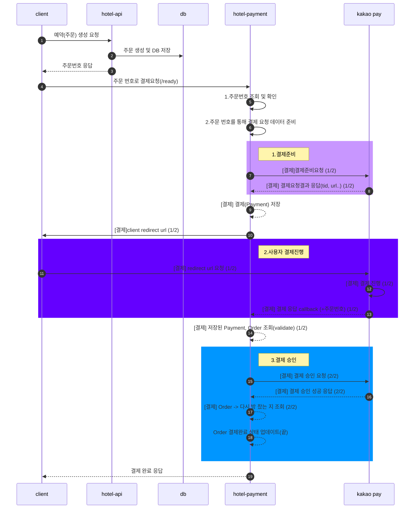

### Payment 흐름

```mermaid

sequenceDiagram
		autonumber
		client->>hotel-api: 예약(주문) 생성 요청
    hotel-api->>db: 주문 생성 및 DB 저장
	  hotel-api-->>client: 주문번호 응답
	  client->>hotel-payment: 주문 번호로 결제요청(/ready)
	  hotel-payment->>hotel-payment: 1.주문번호 조회 및 확인
	  hotel-payment->>hotel-payment: 2.주문 번호를 통해 결제 요청 데이터 준비
	  rect rgb(200, 150, 255)
	  note right of hotel-payment: 1.결제준비
	  hotel-payment->>kakao pay: [결제]결제준비요청 (1/2)
	  kakao pay-->> hotel-payment: [결제] 결제요청결과 응답(tid, url..) (1/2)
	  end
	  hotel-payment-->> hotel-payment: [결제] 결제(Payment) 저장
	  hotel-payment->>client: [결제]client redirect url (1/2)
	  rect rgb(100, 0, 255)
	  note right of hotel-payment: 2.사용자 결제진행
	  client ->> kakao pay: [결제] redirect url 요청 (1/2)
	  kakao pay ->> kakao pay: [결제] 결제 진행 (1/2)
	  kakao pay -->> hotel-payment: [결제] 결제 응답 callback (+주문번호) (1/2)
	  end
	  hotel-payment-->> hotel-payment: [결제] 저장된 Payment, Order 조회(validate) (1/2)
	  rect rgb(0, 150, 255)
	  note right of hotel-payment: 3.결제 승인
	  hotel-payment ->> kakao pay: [결제] 결제 승인 요청 (2/2)
	  kakao pay-->>hotel-payment: [결제] 결제 승인 성공 응답 (2/2)
	  hotel-payment-->> hotel-payment: [결제] Order -> 다시 방 찼는 지 조회 (2/2)
	  hotel-payment-->>hotel-payment: Order 결제완료 상태 업데이트(끝)
	  end
		hotel-payment-->>client: 결제 완료 응답

```