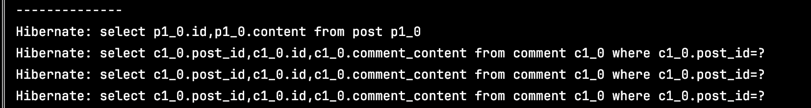
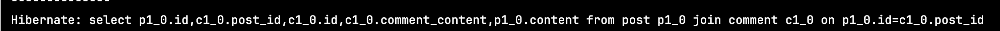
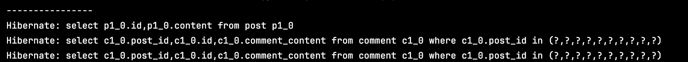
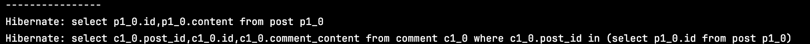

### N+1 현상

- 어떤현상인가
    - ORM 기술과 관련해서 연관관계에 있는 엔티티를 조회할 때 주로 발생하는 문제인데, 데이터를 조회하기 위한 쿼리를 날렸는 데 조회한 데이터 개수가 n개라고 했을 때 그 개수 n 개 만큼 추가로 쿼리가 발생하다고 해서 n + 1 문제라고 한다.
    - 한번에 조회할 수 있음에도 불구하고 비효율적으로 추가적인 쿼리가 나가기 때문에 성능상 문제가 될 수 있다.

```java
  @Test
  void nplusone() {
    // 3개의 post, 각 포스트 마다 10개의 댓글 보유
    Post postA = new Post("A");
    Post postB = new Post( "B");
    Post postC = new Post( "C");

    postA.setComments(generateRandomComments(10));
    postB.setComments(generateRandomComments(10));
    postC.setComments(generateRandomComments(10));

    postRepository.saveAll(List.of(postA, postB, postC));
    em.clear();

    System.out.println("--------------");
    // 1 번의 쿼리
    List<Post> posts = postRepository.findAll();

    // 엔티티의 개수 만큼 각 n 개의 쿼리가 추가로 발생
    // 전체 posts 조회하는 쿼리 1 -> posts 마다 추가로 comments 를 가져오기위한 쿼리 1 발생 따라서 총 posts 의 개수 n 만큼 쿼리 추가 발생
    // n + 1 쿼리
    assertThat(posts.isEmpty()).isFalse();
  }
```



- 어떻게 탐지하는가
    - JAVA 의 경우 JPA 에서 엔티티의 변경사항을 보고 알아서 쿼리를 만들어내기 때문에, 실질적으로 알 수 있는 방법은 없습니다. 그렇기 때문에 application.yaml, [application.properties](http://application.properties) 에서 jpa 옵션 중에 show_sql 이라는 속성이 있는 데 이를 true 로 바꿔 실제 쿼리가 어떻게 발생하는 지 보고 판단할 수 있습니다.
- 어떻게 수정하는가
    - ### 지연로딩으로 세팅하자 ( 우선? 굳이 사용하지 않는 다면 지연로딩으로 풀자 )
    - ### Fetch Join 사용하기
      - 동적으로 원하는 엔티티들을 선택에서 한방에 가져올 수 있도록 한다.

          ```java
          public interface PostRepository extends JpaRepository<Post, Long> {
            
            @Query("select p from Post p join fetch p.comments")
            List<Post> findAllJoinFetch();
          }
          ```

        

    - ### jpql 엔티티 그래프 어노테이션으로 풀기
      엔티티 그래프 기능은 엔티티 조회 시점에 연관된 엔티티들을 함께 조회 하는 기능이다.
      attributePaths 에 가져오려고 하는 연관된 에트리뷰트를 선언한다.

        ```java
         @EntityGraph(attributePaths = "comments")
         @Query("select p from Post p")
         List<Post> findAllPostsAndCommentsWithEntityGraph();
             
        ```
      

    - hibernate 의 `@BatchSize(size)` 로 풀기 1 + 1 으로 나가게 끔

        ```java
        @BatchSize(size = 10)
        @OneToMany(fetch = FetchType.EAGER, mappedBy = "post", cascade = CascadeType.PERSIST)
        public List<Comment> comments;
        ```

      

        - 지정한 size 만큼 sql in 절을 사용해서 조회함
        - 애플리케이션 전체에 hibernate.default_batch_fetch_size 속성 으로도 정할 수 있음
    - hibernate `@Fetch(FetchMode.SUBSELECT)`

        ```java
        @Fetch(FetchMode.SUBSELECT)
        @OneToMany(fetch = FetchType.EAGER, mappedBy = "post", cascade = CascadeType.PERSIST)
        public List<Comment> comments;
        ```

      

    
Eager 로 하면 되나? 사실 이건 jpql 의 문제이다.
사실 repostiroy 에서 만드는 findall 같은 메서드는 결국 내부적으로 jpql 을 사용한다.  
jpql 은 그대로 sql 로 바꿔주기만 하지 추가적인 역할을 하지 않는다. 
따라서 findall () → eager 이면 바로 연관된 것도 join 으로 들고올 거 같지만 그렇지 않다.  
findall 은 그냥 findall 이다. 이때 jpa eager 로 되있네? 그러면 미리다 가져와야 하기 때문에 그제서야 어떻게든 데이터를 다 가져오기 위해 추가 쿼리를 만들어서 가져오는 구조이다.